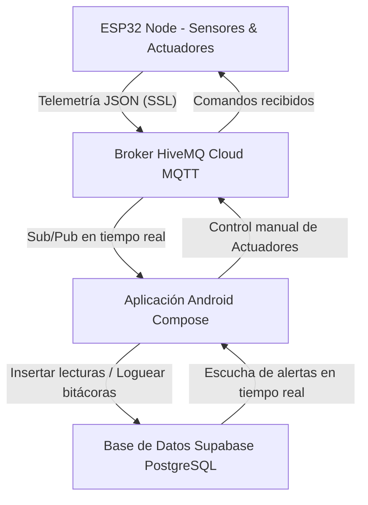

# CityGrid — Manual de Usuario y Configuración del Sistema

Este documento describe la arquitectura, puesta en marcha, calibración de hardware y uso general del sistema inteligente de monitoreo urbano **CityGrid**.

---

## 1. Arquitectura del Sistema

CityGrid consta de tres capas principales que interactúan en tiempo real:



1. **Hardware (ESP32):** Lee de forma continua los sensores ultrasónicos (residuos y nivel de agua) y sensores de luz (LDR), aplicando filtros de ruido por software. Envía los datos como JSONs estructurados vía MQTT seguro (SSL).
2. **Mensajería (HiveMQ Cloud):** Broker MQTT de alta disponibilidad para la sincronización inmediata bidireccional entre las placas físicas y el aplicativo móvil.
3. **Persistencia e Historial (Supabase):** Base de datos PostgreSQL que almacena los registros de telemetría histórica, logs de incidencias (alertas), auditorías de operadores (bitácora del sistema) y mantenimiento preventivo/correctivo.

---

## 2. Configuración y Conexión del Hardware (ESP32)

### Pines del ESP32
* **Ultrasonido Basura 1 (Plástico):** Trig `GPIO 4`, Echo `GPIO 5`, LED Indicador `GPIO 13`
* **Ultrasonido Basura 2 (Inorgánico):** Trig `GPIO 18`, Echo `GPIO 19`, LED Indicador `GPIO 14`
* **Ultrasonido Basura 3 (Orgánico):** Trig `GPIO 21`, Echo `GPIO 22`, LED Indicador `GPIO 27`
* **Ultrasonido Depósito Agua:** Trig `GPIO 25`, Echo `GPIO 26`
* **Sensor de Luz (LDR):** Pin Analógico `GPIO 34`
* **Bomba de Agua (Actuador):** `GPIO 32`
* **LEDs Exteriores (Actuador):** `GPIO 33`
* **Relevador Foco 120V (Actuador):** `GPIO 23`

### Calibración de Sensores
En la cabecera del archivo [sketch_cityGrid.ino](file:///c:/Users/ProyectosDev/Documents/GitHub/citygrid/sketch_cityGrid/sketch_cityGrid.ino) puedes modificar los siguientes parámetros según tus recipientes:
* `ALTURA_CONTENEDOR_CM`: Altura total del bote de basura en centímetros (por defecto 20 cm). Se usa para convertir la distancia medida al porcentaje de llenado (0% a 100%).
* `DISTANCIA_BASURA_CM`: Umbral físico local para encender el LED indicador del bote (5 cm).
* `UMBRAL_LUZ_LDR`: Valor ADC por debajo del cual se considera noche/oscuridad (por defecto 1500).

---

## 3. Guía de Operación de la Aplicación Android

### Inicio de Sesión (Módulo Auth)
1. Al iniciar la aplicación por primera vez, se creará el usuario administrador predeterminado mediante una rutina automática (`seedAdmin`):
   * **Usuario:** `admin@citygrid.com`
   * **Contraseña:** `citygrid123`
2. Si un usuario introduce credenciales incorrectas o la cuenta está desactivada, el sistema mostrará alertas contextuales estilizadas sin revelar información de hashes.

### Pantalla 1: Dashboard General
Muestra el estado resumido e instantáneo de toda la ciudad:
* **Estado de Conexión del ESP32:** Indica si el nodo está en línea (cambia a rojo y dispara una alerta si no se reciben telemetrías durante más de 2 minutos).
* **Módulo de Residuos:** Muestra el contenedor más lleno y su porcentaje actual.
* **Módulo de Agua:** Muestra el porcentaje de agua del tanque y el estado de la bomba.
* **Módulo de Alumbrado:** Indica si las luces están activadas y la lectura del sensor LDR.
* **Historial de Incidencias:** Lista combinada de las últimas alertas registradas en Supabase y MQTT.

### Pantalla 2: Gestión de Residuos
* Monitoreo gráfico del porcentaje de llenado de los tres contenedores (Plástico, Inorgánico y Orgánico).
* Si un contenedor supera el **85%** de capacidad:
  1. Se dispara una notificación push flotante en el teléfono.
  2. Se registra una alerta crítica de color rojo en Supabase.
* Cuando el nivel baja de **20%** (indicando que el camión recolector ya vació el bote), el sistema registra el vaciado exitoso y marca la alerta de vaciado como resuelta de forma automática.

### Pantalla 3: Suministro de Agua
* Visualiza el nivel del depósito. Si el nivel cae por debajo del **30%**, el sistema activa una alerta y enciende la bomba de agua automáticamente.
* **Modo Manual:** El operador puede encender o apagar la bomba pulsando el botón correspondiente. Esta acción anula el modo automático por **60 segundos** antes de regresar al control autónomo para evitar desbordamientos accidentales.

### Pantalla 4: Alumbrado Público
* Muestra la lectura analógica de luz natural en tiempo real.
* **Modo AUTO:** Enciende los reflectores y activa el relevador de alta tensión tras detectar 20 segundos continuos de oscuridad.
* **Modo MANUAL:** Permite al operador forzar el encendido o apagado de las luces desde la aplicación de forma indefinida hasta que decida regresar el interruptor al modo automático.

### Pantalla 5: Historial de Alertas
* Centraliza todas las incidencias (Críticas, Advertencias, Información).
* Permite a los operadores pulsar sobre cualquier alerta pendiente y marcarla como **Atendida**.
* Cada vez que se atiende una alerta, el sistema de auditoría registra la acción, la fecha exacta y el identificador del operador en la bitácora central (`bitacorasistema`).

### Pantalla 6: Registro de Mantenimiento
* Permite registrar mantenimientos preventivos o correctivos para componentes de la ciudad (por ejemplo, reemplazar un sensor de ultrasonido o limpiar los reflectores).
* Muestra un historial detallado de las actividades realizadas por fecha.

---

## 4. Seguridad de Datos e Integración

* **Contraseñas Seguras:** El sistema utiliza hasheo **BCrypt** unidireccional con factor de costo 10 en la base de datos de usuarios para prevenir ataques de diccionario.
* **Políticas RLS en Supabase:** La base de datos cuenta con Row Level Security habilitado. El rol anónimo (`anon`) tiene privilegios limitados: puede insertar registros históricos de telemetría y consultar catálogos, pero tiene **prohibida la eliminación de datos históricos** y solo puede realizar modificaciones controladas en la tabla de alertas y credenciales (evitando ataques de secuestro o borrado malicioso).
* **Consultas Optimizadas:** Los repositorios de la aplicación móvil solicitan los datos ordenados y limitados desde la base de datos de Supabase, evitando la saturación de memoria RAM en el dispositivo del usuario.

---

## 5. Portal Cautivo WiFiManager (Configuración Dinámica)

Si el dispositivo ESP32 pierde la red WiFi de pruebas configurada o se traslada a otra ubicación:
1. El ESP32 encenderá una red WiFi de configuración abierta llamada **`CityGrid_Config_AP`**.
2. Conéctate a ella desde tu teléfono inteligente. Se abrirá automáticamente un **Portal Cautivo** en el navegador. Si el portal no se abre automáticamente, abre cualquier navegador web (Chrome, Safari, etc.) e ingresa a la dirección IP: **http://192.168.4.1**
3. El portal permite:
   * Buscar y seleccionar la nueva red WiFi del lugar e introducir su contraseña.
   * Modificar el servidor MQTT Broker (`7616ccef7e334086bf74b6bb92340be3.s1.eu.hivemq.cloud`), puerto, usuario y contraseña sin necesidad de volver a compilar el código en Arduino IDE.
4. Presiona "Save" (Guardar) para almacenar de forma persistente los parámetros y conectar el hardware.

---

## 6. Canal de Diagnóstico de Hardware (`citygrid/status`)

El ESP32 realiza un autodiagnóstico de salud cada 15 segundos y publica un informe en formato JSON al tópico `citygrid/status`:

### Estructura del JSON de Diagnóstico:
```json
{
  "estado": "ONLINE",
  "uptime": 120,
  "rssi": -65,
  "sensores": {
    "basPlastico": "OK",
    "basInorganico": "OK",
    "basOrganico": "ERROR_DESCONECTADO",
    "nivelAgua": "OK",
    "ldrLuz": "OK"
  }
}
```

### Detección de Desconexiones por Hardware:
* **Sensores de Basura y Agua:** Si el microcontrolador detecta que un sensor ultrasónico responde con `-1` de forma consecutiva durante 5 segundos, marcará dicho sensor como `"ERROR_DESCONECTADO"`.
* **Sensor de Luz (LDR):** Si el valor del LDR se queda pegado en los extremos analógicos (`0` o `4095`) de forma estática por más de 10 segundos, se cataloga con error.
* **Respuesta en la App:** Al recibir un fallo, la app Android disparará inmediatamente una **notificación push crítica** de mantenimiento en el celular del operador y registrará una incidencia en la tabla `alertas` de Supabase.

### Last Will and Testament (LWT):
Si el ESP32 sufre un apagón repentino o pierde señal, el broker HiveMQ detectará el fin del keep-alive y publicará en el mismo tópico de status el payload:
```json
{"estado": "OFFLINE"}
```
La aplicación Android procesa esta señal al instante, actualizando todos los paneles a "Desconectado" y alertando al operador en tiempo real.
